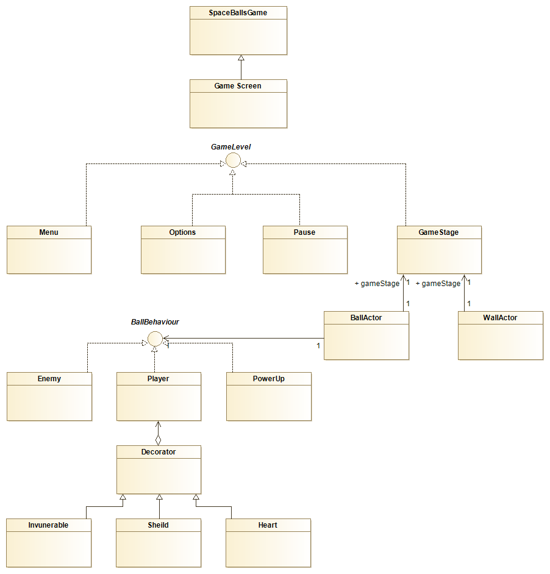
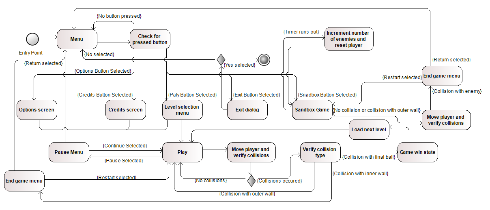

# LPOO1617_T6G11

### Class Diagram

### Activity Diagram

## Tests

### TEST 1: (PLAYER BALL)
Check if the player controlled ball cannot get out of the viewport, meaning it will hit a wall and stop.

OBJECTIVE:Make sure the player can always see the ball he is controlling.

### TEST 2: (AI BALLS)
Test if the ai balls correctly direct them self to the player ball. Tested by placing a number of Ai balls on the game area and verifying that after a certain amount of time they ALL hit the player's ball.

OBJECTIVE:Make sure the game presents a challenge and is working as intended.

### TEST 3: (GENERAL BALLS)
Test if a ball either the player's or the Ai's isn't able to cross a wall. Tested by placing both an Ai and a player ball in an area surrounded by walls and making sure it does not leave it.

OBJECTIVE:
Make sure the game is working as intended.

### TEST 4: (POWER UP BALLS)
Test if after hitting a power up ball the player's ball is affected by the respective power up.

OBJECTIVE:
Make sure power up are aftecing the player's ball.

### TEST 5: (SHIELD POWER UP)
Test if when a shield if affecting the player he does not loose on being hit by an Ai ball.

OBJECTIVE:
Make sure the game is working as intended.

### TEST 6: (LEVELS-DEATH WALLS)
Test if when playing a level the player looses upon hitting a certain wall.

OBJECTIVE:
Make sure the game is working as intended.

### TEST 7: (LEVELS-VICTORY)
Test if when the player hits the victory ball the game ends in victory and is marked as complete.

 Tiago Costa Neves 201506203 up201506203@fe.up.pt
 
 Eduardo de Mendonça Rodrigues Salgado Ramos 201505779 up201505779@fe.up.pt
