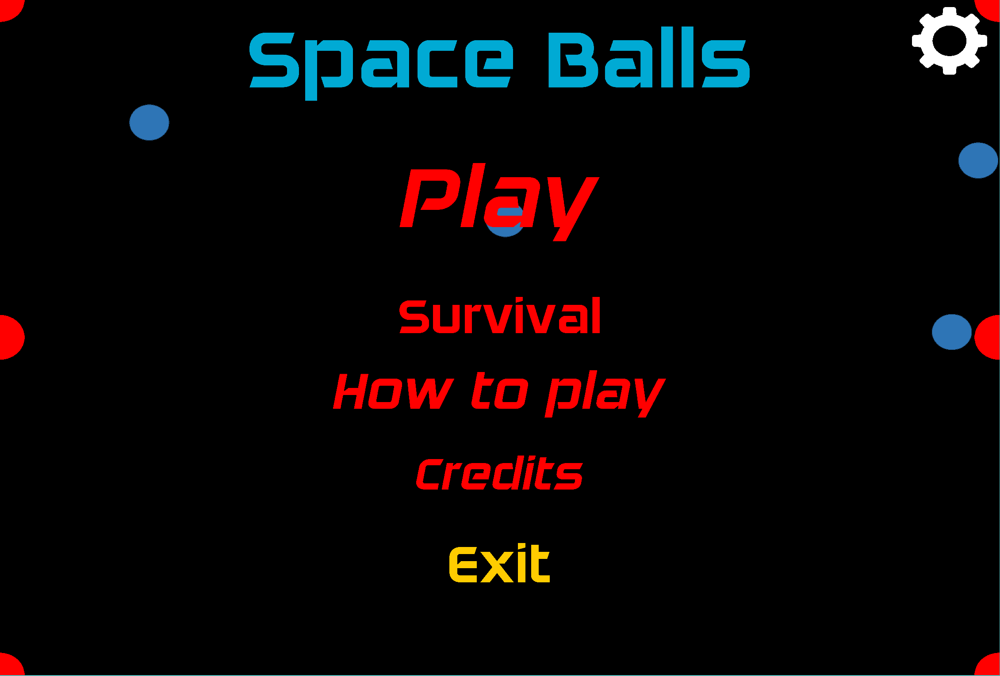
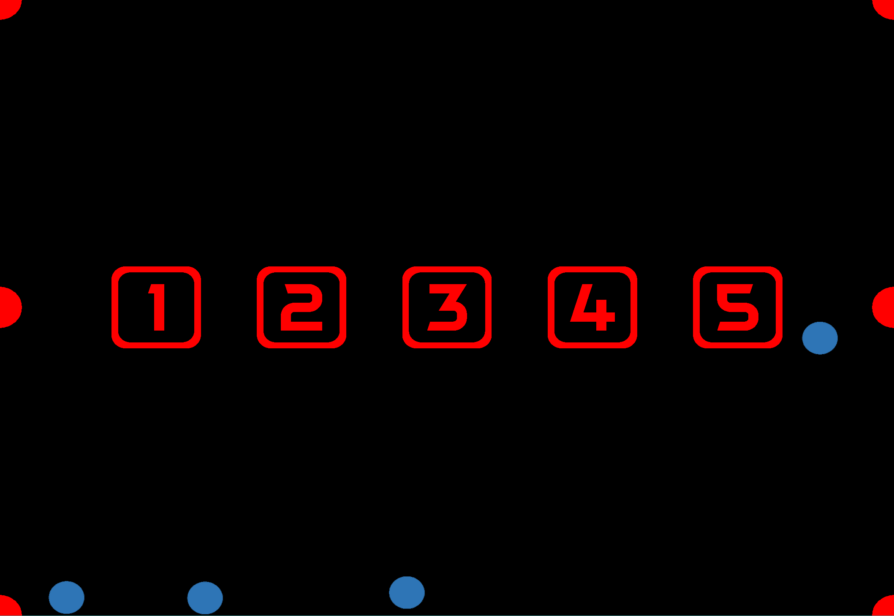
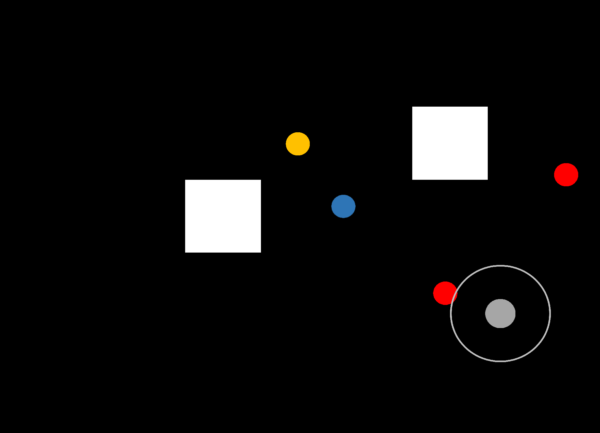
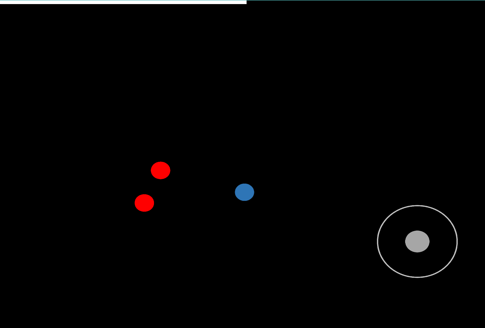
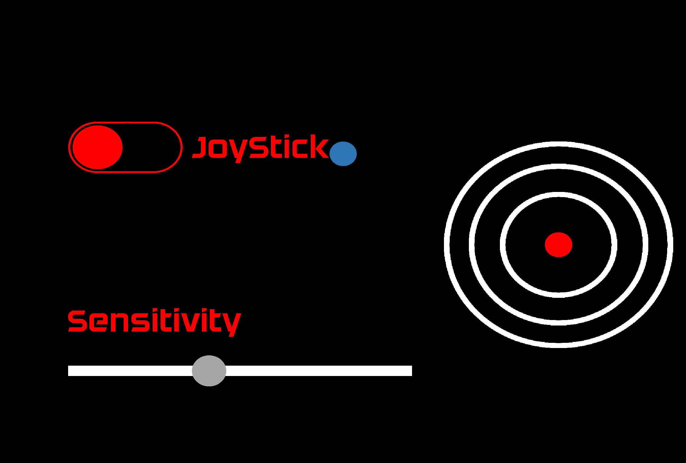
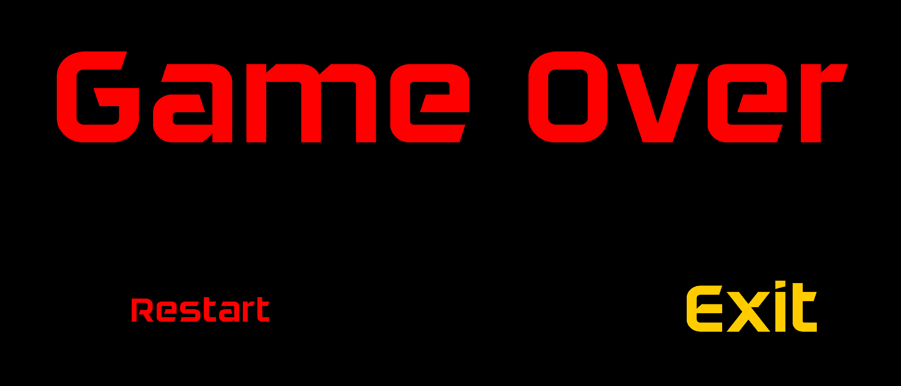

# LPOO1617_T6G11

# Setup

## Project Installation
To intall and further develop the project it is necessary to build the project using Gradle. LibGDX libraries are also nedded.
## App installation
To install the app the user needs to download the .apk file available in the repository root and install it in the desired android device.
# Work Load
The work load was evenly distibuted amongst both group members, with an approximate development time of 50 hours.

# Development Documentation
## Javadoc Core Documentation
[Java Documentation](JavaDoc/) for core module.
## UML Diagrams

## Design Patterns used
The Design Patterns used to solve development problems were
* Factory - The factory pattern was used to select the views to be displayed.
* Template Function - One template method was used in the GameView class, drawEntities and handleInputs are the template functions.
* Singleton - Various singleton classes were used.
* Strategy - The startegy pattern was applied to create an interface needed by the game but implemented according to the platform.
* MVC - The high-level arquitecture used was Model-View-Controller.

## Difficulties and Lessons Learned
* Starting the implementation of the MVC architecture proved to be quiet difficult as it was quiet different to what we were used to. However we quicklly realised it was the best way to go when it comes to game develloping and would definitely use it again.
* We faced a big challenge as to how we were going to save the options. A solution was found through the use of the built-in android and Windows preferences saving API. The local application recurs to an interface implemented on each platform module and used in the core module.
* Adjusting the scale and position of buttons and other static elements on the screen proved to be time consuming and if we were to do another application based on libGDX we would certainly make use of the provided table class. In this work no tables were used as the existance of tables was unknow to us until the very end of the project and it would not improve in a significant way.

# User Manual

## The Main menu (entry point of the application)

The main menu is the first screen you will be presented with when you start the app. First thing you will notice is the background is not static and is acctualy resposnive to your device movements (if you are not running the application on a mobile device we are sorry but you will not be able to take profit of this feature :'( ), you are also presented with a choice of submenus to enter, they are as follow: 
* The Play Button will take you to the [Levels Menu](https://github.com/pigaoMIEIC/LPOO1617_T6G11/blob/finalRelease/README.md#levels-menu).
* The Survival Button will launch you straight into [Survival mode](https://github.com/pigaoMIEIC/LPOO1617_T6G11/blob/finalRelease/README.md#survival-game-mode) gameplay.
* The How to play button will take you to a screen with instructions on how to play the game.
* The Credits button will take you to a screen whit the credits.
* On the top right corner you can press the cog to enter the [Options](https://github.com/pigaoMIEIC/LPOO1617_T6G11/blob/finalRelease/README.md#options-menu) screen.
* The highlighted exit button will do exactly what is says.
## Levels Menu

In this screen you are presented with the choice of a level there is no incrementing difficulty just pick one and have fun.
## Level Play

This is an example of a Level, your goal is to reach the yellow ball with out being caught by the red balls, you are free to touch the wall but be carefull they are quiet bouncy. The use of the joystick is configurable in the options menu.
## Survival game mode

This is an endless mode of the game no walls to stop you and no yellow ball to be reached. Avoid the red balls if you want to survive every time the white bar is full another enemy will apear to hunt you down. The use of the joystick is configurable in the options menu.
## Options Menu

In these menu you can edit your settings. Choose whether you want to play with the joystick or with the device accelerometer after that go on and select a sensitivity level, you can use the ball in the background to test it out. In case you decide to use your device accelrometer and don't fancy playing with your phone horizontally you can touch the target on the right to calibrate your movements.
## Game Over

You can reach this screen by loosing either a level or a survival game press exit to return to the main menu or restart to try the game again.

#### Developed by:
 
 Tiago Costa Neves 201506203 up201506203@fe.up.pt
 
 Eduardo de Mendonça Rodrigues Salgado Ramos 201505779 up201505779@fe.up.pt
